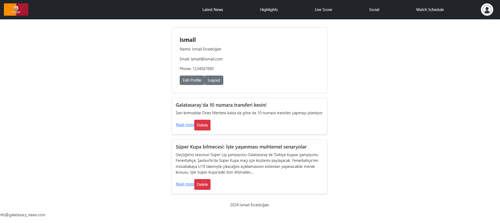

# Galatasaray News Application

## 1. Explanation

The Galatasaray News Application is a web application designed to provide the latest news and match schedules related to Galatasaray sports club. The application allows users to register, log in, edit their profiles, and save their favorite articles for easy access later. 

### Features
- Latest news updates
- Match schedules 
- User authentication (sign up, log in, log out)
- Profile management
- Save and view articles
- Delete saved articles
  
## 2. Usage Scenarios

### Home Page
The home page displays the latest news articles related to Galatasaray.

### Match Schedule Page
The match schedule page shows the upcoming matches, including date, time, venue, and opponent.

### User Profile Page
The user profile page allows users to view and edit their profile information, including username, email, and phone number. Users can also view their saved articles.

#### Login Form

#### Signup Form

#### User Profile 

The Users will be able to see their profile after a succesful login or signup. 
### Edit Profile

## 4. Libraries 

- **React**: A JavaScript library for building user interfaces.
- **Next.js**: A React framework for server-side rendering and generating static websites.
- **Bootstrap**: A CSS framework for developing responsive and mobile-first websites.
- **Reactstrap**: React components for Bootstrap.
- **JSON Server**: A full fake REST API for testing and prototyping.

## 5. Instructions for Running the Project

### Prerequisites
- Node.js (version 14.x or higher)
- npm (version 6.x or higher)

### Steps to Run the Project

1. Download and Extract the Project Zip File or Clone the repository: git clone https://github.com/ismailercedogan/News_App_React.git
2. Navigate to the Project Directory
   - cd path/to/extracted/project
3. Install Dependencies
   - npm install
4. Start the JSON Server and Development Server
    - npm run all

## Upcoming Updates

- Live Score Page 
- Higlights Page
- Social Page

These pages are currently under development and will be available in future updates.
